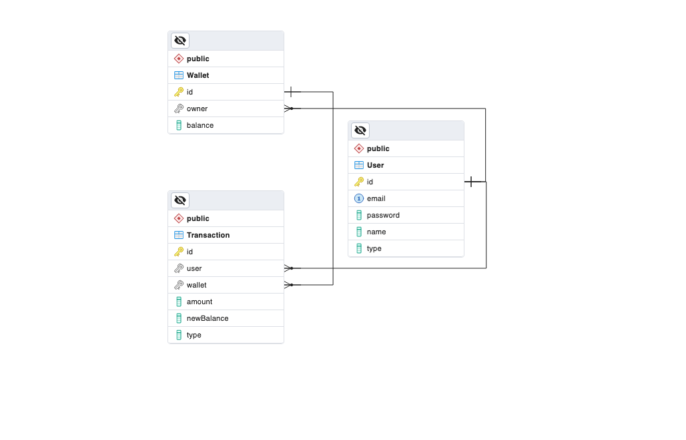

# Basic E-Wallet System

## Introduction

This is a simple E-wallet app which will let the customer to have their own E-wallet associated. Each customer can have only a maximum of 2 e-wallets.
The user can perform `DEBIT` or `CREDIT` operation on their wallet.

To get this project up and running, follow the below flow,
```
  $ npm install
  $ npm start
```

## Models
### User
The User Schema holds info about the user, including name, email, password and role.\
Currently, a user can have roles as "customer" or "admin".

### Wallet
The Wallet Schema holds info about the e-wallets associated to a user.\
This includes the owner details and wallet amount balance. The owner is a foreign key reference to User collection.

### Transaction
The transaction schema holds info about every single transactions made on a wallet by a user.\
The information included here are, the type of transaction (DEBIT or CREDIT), the Transaction timestamp, the amount submitted for this transaction, the new Balance amount in the wallet.



## Dockerfile Usage
To build the docker from `Dockerfile`:\
`$ docker build -t <build_name>:<tag> -f <Dockerfile name>`\
& to run the command (you may explore on further docker option if needed):\
`$ docker run -p <external_port>:<internal_port> -d <build_name>:<tag>`

Example command:
```
$ docker build -t ewallet:1.0.0 .
...
$ docker run -p 3000:3000 -d ewallet:1.0.0
```

## Linters
`Eslint` is used and standard config is used for linting.

## Logging
`Winston` is used with express server for the logging purpose. The server log format is described in the utils

## Testing
`Jest` is used for unit testing the application. The config is set on `jest.config.js`

## Available Scripts
In the project directory, you can run:

### `npm start`

Starts up the server production mode. Navigate to [http://localhost:3000](http://localhost:3000) to view it in the browser.

### `npm run dev`

Triggers the application server in `Dev` mode.\
Open [http://localhost:17011](http://localhost:17011) to view it in the browser.


### `npm run lint`

Triggers a eslint test on the complete application. \
All the js will be going through the linter config specified on `.eslintrc`.

### `npm run lint:fix`

Triggers a eslint test on the complete application. \
All the js will be going through the linter config specified on `.eslintrc`.\
While performing lint check, it also fixes few possible linter issues \

To dump the output of linters into a file and in some format, use `-- -f <format> -o <output_file>`\
example: `$ npm run lint-fix:js -- -f json -o eslint.out.json`

### `npm test`

This shall trigger jest testing on the application test files.\
Additionally, to get the coverage details, we can add arguments `-- --coverage`

## Future Considerations for Development
- Currently API docs is done via `apidoc` node package. Update it to swagger api along with necessary example.
- Login API is manually setup, we can alter it to use Auth0 or 1Password or something that provides login workflow out of box (including `Forget Password`, etc)
- If more user roles needed, then extend DB model for RBAC setup. For example, "REVIEWER" role for user to approve some transactions.
- Currently, only `CREDIT` and `DEBIT` are the transactions supported. The application can be extended to support, money transfer from one wallet to the other.
- Update the wallet & user deletion to soft-delete based on need and data scale needed
- Add UI for register/login and perform different operations with the e-wallet
- Update the Dockerfile to have more security. For example, better handling of signals by using `tini` entry point as a separate docker stage
- Only the major controllers & few middlewares are tested. The test coverage is not 100%. More test files for models and validators can be added.
